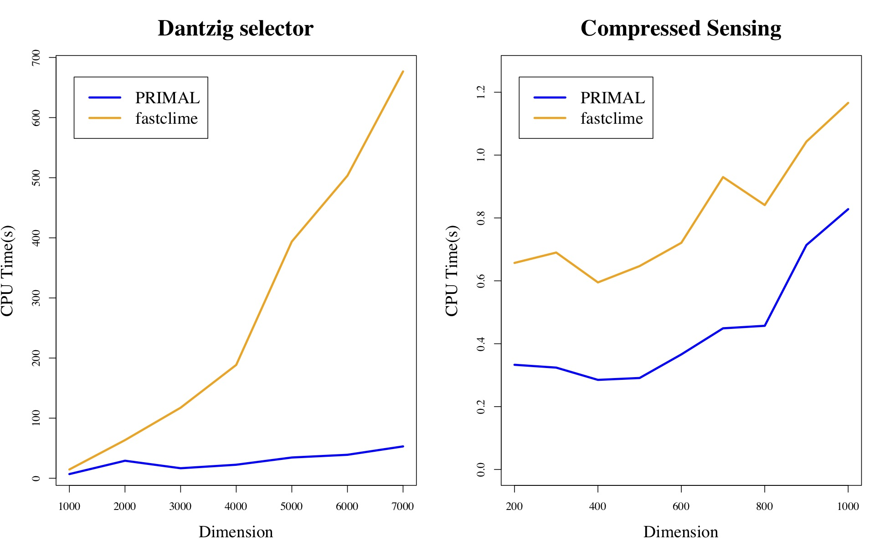

---
# Feel free to add content and custom Front Matter to this file.
# To modify the layout, see https://jekyllrb.com/docs/themes/#overriding-theme-defaults

layout: home

---

  

Hi! This is Qianli Shen（沈千里）:) 

I’m a second-year PhD student at [School of Computing](https://www.comp.nus.edu.sg/),  [National University of Singapore](https://www.nus.edu.sg/), advised by [Prof. Kenji Kawaguchi](https://people.csail.mit.edu/kawaguch/). Previously, I completed my B.S. in Computer Science at [Peking University](http://english.pku.edu.cn/) in July 2020, advised by [Prof. Zhanxing Zhu](https://sites.google.com/view/zhanxingzhu/). In summer 2019, I visited [ISyE](https://www.isye.gatech.edu/), [Georgia Tech](https://www.gatech.edu/), working with [Prof. Tuo Zhao](https://www2.isye.gatech.edu/~tzhao80/). 

My research interests are in the practice in Machine Learning, especially Deep Learning. Recently, I’m working on Physics-Informed Machine Learning and Deep Reinforcement Learning.

Collaborations, discussions and chats are always welcome!

Email: shenqianli [at] u.nus.edu 

[CV](assets/cv.pdf) / [Google Scholar](https://scholar.google.com/citations?user=p3ekN2kAAAAJ&hl=en) / [GitHub](https://github.com/ShenQianli) / [WeChat](assets/img/wechat.JPG) / [Ins](https://www.instagram.com/about311miles/) / [Twitter](https://www.twitter.com/ShenQianli)

 
 

# Publications

<b>Deep Reinforcement Learning with Robust and Smooth Policy</b> [<a href="https://arxiv.org/abs/2003.09534">arxiv</a>][<a href="https://www2.isye.gatech.edu/~tzhao80/III1717916/proj18_smooth.html">html</a>]  
 
<b>Qianli Shen*</b>, Yan Li*, Haoming Jiang, Zhaoran Wang and Tuo Zhao
 
<i>International Conference on Machine Learning (ICML), 2020</i> 
 

 

<b>GFlowOut: Dropout with Generative Flow Networks. International Conference on Machine Learning</b> [<a href="https://arxiv.org/abs/2003.09534">arxiv</a>] 
 
Dianbo Liu, Moksh Jain, Bonaventure F. P. Dossou,  <b>Qianli Shen</b>, Salem Lahlou, Anirudh Goyal, Nikolay Malkin, Chris Chinenye Emezue, Dinghuai Zhang, Nadhir Hassen, Xu Ji, Kenji Kawaguchi and Yoshua Bengio
 
<i>International Conference on Machine Learning (ICML), 2023</i> 
 

 
 

# Softwares

<b>PRIMAL: PaRametric sImplex Method for spArse Learning</b> [<a href="https://github.com/ShenQianli/primal">GitHub</a>] 
 
<b>Qianli Shen*</b>, Zichong Li*, Yujia Xie and Tuo Zhao
 

