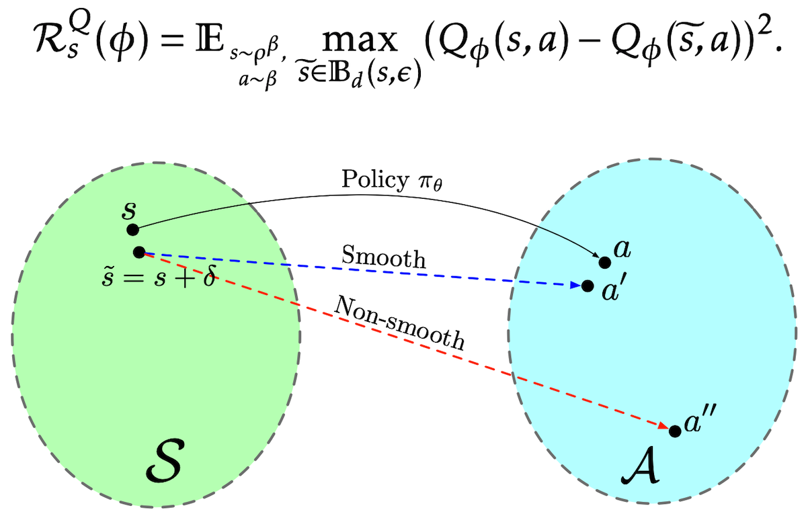

---
# Feel free to add content and custom Front Matter to this file.
# To modify the layout, see https://jekyllrb.com/docs/themes/#overriding-theme-defaults

layout: home
---

  

Hi! This is Qianli Shen（沈千里）:) 

I’m now on my gap year working as a research intern at [Huawei Technologies Noah’s Ark Lab](http://www.noahlab.com.hk/#/home), working with Dr. Chen Chen and [Prof. Jianye Hao](http://www.icdai.org/jianye.html). Previously, I completed my B.S. in Computer Science at [Peking University](http://english.pku.edu.cn/) in July 2020, advised by [Prof. Zhanxing Zhu](https://sites.google.com/view/zhanxingzhu/). In summer 2019, I visited [ISyE](https://www.isye.gatech.edu/), [Georgia Tech](https://www.gatech.edu/), working with [Prof. Tuo Zhao](https://www2.isye.gatech.edu/~tzhao80/).

My research interests are in practical (data-efficient, safe & robust) **reinforcement learning** algorithms. I’m also interested in applying machine learning methods in industrial scenarios and developing high-performance ML softwares.

For some reason, my graduate study has been postponed. (a peaceful and safe world plz :) ) Now I’m open to potential research positions. Collaborations, discussions and chats are always welcome!

Email: shenqianli [at] pku.edu.cn 

[CV](assets/cv.pdf) / [Google Scholar](https://scholar.google.com/citations?user=p3ekN2kAAAAJ&hl=en) / [GitHub](https://github.com/ShenQianli) / [Ins](https://www.instagram.com/about311miles/) / [Twitter](https://www.twitter.com/ShenQianli)

 
 
# Publications

<b>Deep Reinforcement Learning with Smooth Policy</b> [<a href="https://arxiv.org/abs/2003.09534">arxiv</a>] 
 
<b>Qianli Shen*</b>, Yan Li*, Haoming Jiang, Zhaoran Wang and Tuo Zhao
 
<i>International Conference on Machine Learning (ICML), 2020</i> 
 

 
 
# Softwares

<b>PRIMAL: PaRametric sImplex Method for spArse Learning</b> [<a href="https://github.com/ShenQianli/primal">GitHub</a>] 
 
<b>Qianli Shen*</b>, Zichong Li*, Yujia Xie and Tuo Zhao
 

